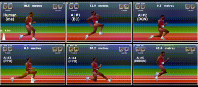

# QWOP Gym

A Gym environment for Bennet Foddy's game called _QWOP_.

[Give it a try](https://www.foddy.net/Athletics.html) and see why it's such a
good candidate for Reinforcement Learning :)


### Features

* A call to `.step()` advances exactly N game frames (configurable)
* Option to disable WebGL rendering for improved performance
* Satisfies the Markov property \*
* State extraction for a slim observation of 60 bytes
* Real-time visualization of various game stats (optional)
* Additional in-game controls for easier debugging

\* given the state includes the steps since last hard reset, see [♻️ Resetting](./doc/env.md#resetting)

## Getting started

1. Install [Python](https://www.python.org/downloads/) 3.10
1. Install a chrome-based web browser (Google Chrome, Brave, Chromium, etc.)
1. Download [chromedriver](https://googlechromelabs.github.io/chrome-for-testing/) 116.0 or higher
1. (optional) Have general knowledge of Python, JavaScript, WebSockets, Gym and RL algorithms
1. (optional) Create a [W&B](https://wandb.ai) account

Install python dependencies:

```bash
pip install -r requirements.txt
```

> [!NOTE]  
> Check the notes in `requirements.txt` if you are getting errors during installation.

Download QWOP.min.js and patch it:

```bash
curl -sL https://www.foddy.net/QWOP.min.js | python src/game/patcher.py
```

Configure `browser` and `webdriver` paths in [`./config/env.yml`](./config/env.yml), then try it out:

```bash
python qwop-gym.py play
```

Explore the other commands supported by `qwop-gym.py`:

```bash
$ python qwop-gym.py -h
usage: qwop-gym.py [options] <action>

options:
  -h, --help  show this help message and exit
  -c FILE     config file, defaults to config/<action>.yml

action:
  play              play QWOP, optionally recording actions
  replay            replay recorded game actions
  train_bc          train using Behavioral Cloning (BC)
  train_gail        train using Generative Adversarial Imitation Learning (GAIL)
  train_airl        train using Adversarial Inverse Reinforcement Learning (AIRL)
  train_ppo         train using Proximal Policy Optimization (PPO)
  train_dqn         train using Deep Q Network (DQN)
  train_qrdqn       train using Quantile Regression DQN (QRDQN)
  spectate          watch a trained model play QWOP, optionally recording actions
  benchmark         evaluate the actions/s achievable with this env
  help              print this help message

examples:
  qwop-gym.py play
  qwop-gym.py play -c config/record.yml 
```

For example, to train a PPO agent, edit [`config/ppo.yml`](./config/ppo.yml) and run:

```bash
python qwop-gym.py train_ppo
```

> [!WARNING]
> Although no rendering occurs during training, the browser window must remain
> open as the game is actually running at very high speeds behind the curtains.

Visualize tensorboard graphs:

```bash
tensorboard --logdir data/
```

Configure `model_file` in [`config/spectate.yml`](./config/spectate.yml) and watch your trained agent play the game:

```bash
python qwop-gym.py spectate
```

### Imitation

For imitation learning, first record some of your own games:

```bash
python qwop-gym.py play -c config/record.yml 
```

Train an imitator via [Behavioral Cloning](https://imitation.readthedocs.io/en/latest/tutorials/1_train_bc.html):

```bash
python qwop-gym.py train_bc
```

### W&B sweeps

If you are a fan of [W&B sweeps](https://docs.wandb.ai/guides/sweeps), you can 
use the provided configs in `config/wandb/` and create your sweeps like so:

```bash
# create a new W&B sweep
wandb sweep config/wandb/qrdqn.yml

# start a new W&B agent
wandb agent <username>/qwop/<sweep>
``` 

You can check out my W&B QWOP project [here](https://wandb.ai/s-manolloff/qwop-gym).
Keep in mind that I have not put much effort in writing meaningful names or
descriptions to my sweeps/runs, plus it contains runs from older iterations
of the env, which might look confusing. At the very least, you can find
model artifacts (zip files) of some top performing agents.

Check out this [youtube video](https://www.youtube.com/watch?v=2qNKjRwcx74) for
a showcase of my trained agents.



## Developer documentation

Info about the Gym env can be found [here](./doc/env.md)

Details about the QWOP game can be found [here](./doc/game.md)

## Similar projects

* https://github.com/Wesleyliao/QWOP-RL
* https://github.com/juanto121/qwop-ai
* https://github.com/ShawnHymel/qwop-ai

In comparison, qwop-gym offers several key features:
* the env is _performant_ - perfect for on-policy algorithms as observations
can be collected at great speeds (more than 2000 observations/sec on an Apple
M2 CPU - orders of magnitute faster than the other QWOP RL envs)
* the env satisfies the _Markov property_ - randomness and race conditions have
been removed and recorded episodes are 100% replayable
* the env has a _simple reward model_ and compared to other QWOP envs, it is
less biased, eg. no special logic for stuff like _knee bending_,
_low torso height_, _vertical movement_, etc.
* great results (fast, human-like running) achieved by RL agents trained
entirely through self-play, without pre-recorded expert demonstrations
* qwop-rl already contains scripts for training with 6 different algorithms and
adding more to the list is simple - this makes it suitable for exploring and/or
benchmarking a variety of RL algorithms
* QWOP's original JS source code is barely modified: 99% of all extra
functionality is designed as a plugin, bundled separately and only a "diff"
of QWOP.min.js is published here (in respect to Benett Foddy's kind request
to refrain from publishing the QWOP source code as part of is _not_
open-source).

## Caveats

The below list highlights some areas in which the project could use some
improvements:

* the OS may put some pretty rough restrictions on the web browser's rendering
as soon as it's put in the background (on OS X at least). Ideally, the browser
should run in a headless mode, but I couldn't find a headless browser that can
support WebGL.
* `gym` is deprecated since October 2022 and this project should be migrated to
`gymnasium` as soon as
[this](https://github.com/HumanCompatibleAI/imitation/pull/735) is out of the
way.
* `wandb` uses a monkey-patch for collecting tensorboard logs which does not
work well with GAIL/AIRL/BC (and possibly other algos from `imitation`). As a
result, graphs in wandb have weird names. This is mostly an issue with `wandb`
and/or `imitation` libraries, however there could be a way to work around this
here.

## Contributing

Here is a simple guide to follow if you want to contribute to this project:

1. Find an existing issue to work on or submit a new issue which you're also
going to fix. Make sure to notify that you're working on a fix for the issue
you picked.
1. Branch out from latest `main`.
1. Make sure you have formatted your code with the [black](https://github.com/psf/black)
formatter.
1. Commit and push your changes in your branch.
1. Submit a PR.
