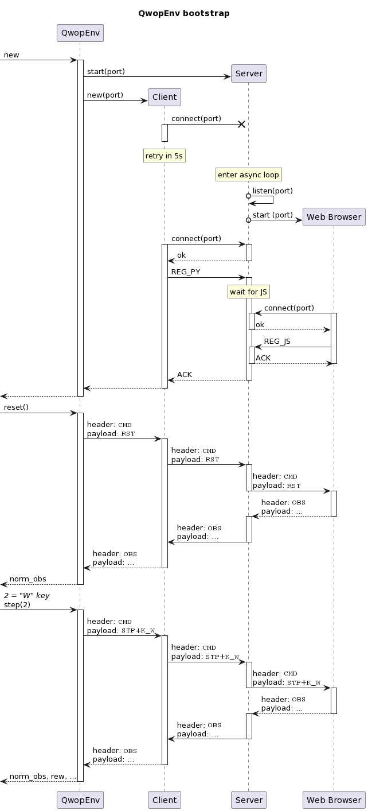

# RL Environment

Here you will find details about the `QwopEnv-v1` Gym environment.

## Starting


QWOP is a JavaScript game which relies on WebGL -- this means it _must_ run
within a web browser.

Starting the RL environment automatically starts a web browser in a separate
system process. The two processes use WebSockets to communicate with each
other. Check the [Bootstrap process](#bootstrap-process) and
[Communication protocol](#communication-protocol) sections for details.

To start the env:

```python
from src.env.v1.qwop_env import QwopEnv

env = QwopEnv(
  browser="/Applications/Brave Browser.app/Contents/MacOS/Brave Browser",
  driver="/Users/simo/Projects/qwop/vendor/chromedriver",
  auto_draw=True,
  stat_in_browser=True,
)
```

And in case you need it registered in `gym`:

```python
import gym.envs

gym.envs.register(
  "QwopEnv-v1",
  entry_point="src.env.v1.qwop_env:QwopEnv",
  kwargs={"browser": "...", "driver": "..."}
)

env = gym.make("QwopEnv-v1")
```

## 🕹️ Actions

There are 16 discrete actions in the game, corresponding to 0, 1, 2, 3 or
4-key combinations of the below keys:

- Q (thighs 1)
- W (thighs 2)
- O (calves 1)
- P (calves 2)

Performing an action is done via the env's `step` method, which expects an
integer as input, so each action is mapped to a key (combination) as follows:

0=(none), 1=Q, 2=W, 3=O, 4=P, 5=Q+W, ..., 15=Q+W+O+P

Optionally, the `15` action (Q+W+O+P) can be re-mapped to the "R" key in order
to immediately terminate the env (ie. press "R" for restart). This behaviour
is controlled by the `r_for_terminate` env constructor argument.

To perform an action:

```python
# advances a timestep with the "P" key pressed
(observation, reward, done, info) = env.step(4)
```

## 👁️ Observations

On each step, the browser sends the following data to the RL env:

* game state (termination condition)
* time elapsed (used in [reward](#rewards) calculations)
* distance ran (used in [reward](#rewards) calculations)
* body state

The body state contains data about the athlete's 12 body parts:
- Torso
- Head
- Left Arm
- Left Calf
- Left Foot
- Left Forearm
- Left Thigh
- Right Arm
- Right Calf
- Right Foot
- Right Forearm
- Right Thigh

Each of those body parts is represented by 5 floats:

|  #  | Description        | Min   | Max   | Unit        | Note
|-----|--------------------|-------|-------|-------------|------------
| 0   | position (x-axis)  | -10   | 1050  | decimeters  |
| 1   | position (y-axis)  | -10   | 10    | decimeters  |
| 2   | angle vs horizon   | -6    | 6     | radians     |
| 3   | velocity (x-axis)  | -20   | 60    | ?           |
| 4   | velocity (y-axis)  | -25   | 60    | ?           |

This makes total of `60` floats for the body state, which are normalized and
then returned as the `obs` (an `np.ndarray((60,), dtype=np.float32)`) element
of the env's `step` return values.

To examine the observation:

```python
# The Head's (x,y) position (normalized)
head_nx = obs[5]
head_ny = obs[6]

# Denormalize and print the values:
head_x = env.pos_x.denormalize(head_nx)
head_y = env.pos_y.denormalize(head_ny)

print("Head (x, y) = (%.2f, %.2f)" % (head_x, head_y))
```

## 🍩 Rewards

The reward on each step is equal to:

```math
R = C_s\frac{\Delta_s}{\Delta_t} - C_t \Delta_s
```

where:
* `R` is the reward
* `Δs` is the change in distance ran since last step
* `Δt` is the change in time elapsed since last step
* `Cs` and `Ct` are (configurable) constants

## 💀 Termination

The env will terminate whenever the athlete:
* _steps_ or _falls_ beyond the 100-meter mark (considered a success)
* reaches the 105-meter mark (considered a success) *
* falls anywhere else (considered a failure)
* reaches the -10-meter mark (considered a failure)

\* In rare cases, the athlete goes past the finish line without the game
detecting ground contact due to a bug, so a 105m end-game condition was added.

## 🔌 Shutting down

For a graceful shutdown:

```python
env.close()
```

## Troubleshooting

A good place to start would be to enable some logging and familiarize yourself
with some of the technical details around the bootstrap process and the
communication protocol used.

### Logging

To enable logging, change the `LEVEL` var in [log.py](./src/env/v1/util/log.py).

Setting `LEVEL=0` will print a user-friendly text representation of messages
sent over the websocket channel which is usually hard to debug.
Read the sections below for more details on the server/client communication.

### Bootstrap process

Creating an instance of `QwopEnv` launches a WebSocket server and a web browser.
Both the env and the browser connect to the WebSocket server, which acts as a
message proxy between the two clients - a process best described via the
sequence diagram below:




### Communication protocol

The env<->browser communication is governed by a protocol designed specifically
for this purpose. It consists of a 1-byte header and variable-length payload,
here are some examples:

| Message description | byte 1 | byte 2 | bytes 3+ |
|-------------|--------|--------|----------|
| Registration request | `0` | (id) | |
| Registration accepted | `1` | | |
| Registration rejected | `2` | | |
| Game command: "W" key | `3` | `0b00000101` | step (1 byte) | reward (4 bytes) | total_reward (4 bytes)
| Game command: restart game | `3` | `0b00100001` | |
| Game command: take screenshot | `3` | `0b10000000` | |
| Game response: observation | `4` | `0b00000000` | time (4 bytes) + distance (4 bytes) + body state (60 bytes) |
| Game response: observation (game over) | `4` | `0b00000010` | time (4 bytes) + distance (4 bytes) + body state (60 bytes) |
| Game response: screenshot (JPEG) | `5` | `0b00000000` | (image data) |
| Game response: screenshot (PNG) | `5` | `0b00000001` | (image data) |
| Log | `6` | (utf-8 text) | (utf-8 text - cont.) |
| Error | `7` | (utf-8 text) | (utf-8 text - cont.) |
| Reload page | `8` | | |
